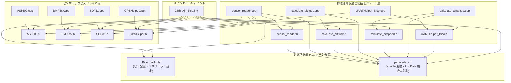

# ファイル構成とインクルード依存関係・共有データ設計

`26th_Air_Bico` プロジェクトは、RP2040（Raspberry Pi Pico / Pico W）のデュアルコア上で多数の物理センサー読み取り、通信プロトコル、高度なエアデータ物理計算を整理・分割して実行するため、役割ごとに明確にモジュール化されています。

---

## 1. 各ファイルの個別責務と役割まとめ

| ファイル名 | 分類 | 主な役割・責務 |
| :--- | :---: | :--- |
| **`26th_Air_Bico.ino`** | エントリ | メインプログラムエントリ。Core 0（`setup`/`loop`）および Core 1（`setup1`/`loop1`）のタスク定義、100Hz ハードウェアタイマー割り込み設定、Mutex/FIFO 初期化、Watchdog 監視。 |
| **`Bico_config.h / .cpp`** | 設定・ピン | Bico 基板上の物理ピン定義（LED 6ピン、UART 4系統 TX/RX、I2C 2系統 SDA/SCL、リセットボタン等）。 |
| **`parameters.h / .cpp`** | 共有状態 | 全サブシステムのエアデータやフライトログ変数（計54項目）を `extern volatile` で宣言し、構造体 `LogData` を定義するグローバル共有データストレージ。 |
| **`UARTHelper_Bico.h / .cpp`** | 通信・DMA | `Serial1`（ICS）, `Serial2`（Xiao/ESP）, `SerialPIO`（Under, Fslg）の 4系統 UART 初期化・DMA チャネル構成（`initUART_DMA`）、CSV ヘッダー送信（`transmitHeader`）、時分割ログ送信（`transmitLog`）、コマンド検知（`handleEspSignal`）。 |
| **`sensor_reader.h / .cpp`** | センサー読取 | 自基板上の I2C / UART センサー読み取りを統合・ラップするモジュール（`update_air_bmp`, `update_air_AS5600`, `update_air_SDP`, `update_air_gps`）。 |
| **`calculate_altitude.h / .cpp`** | 物理計算 | 自基板・機体下・胴体桁の 3系統 BMP 気圧高度を計算・移動平均化・プラットフォーム補正し、中央値をとる気圧高度決定処理および超音波/LiDAR 高度フィルタ・離陸判定（`is_takeoff`）。 |
| **`calculate_airspeed.h / .cpp`** | 物理計算 | SDP31 差圧と気温・気圧から対気速度を物理公式（$\sqrt{2\Delta P \frac{T}{P} \frac{R}{M}}$）で導出し、二次式補正 (`correct_airspeed`) を適用して移動平均を算出する処理。 |
| **`AS5600.h / .cpp`** | センサドライバ | I2C (`Wire`) 経由での AS5600 磁気式エンコーダ（2個）読み出しドライバ。迎え角 (AoA) および横滑り角 (AoS) を角度 (`deg`) へ変換。 |
| **`BMP3xx.h / .cpp`** | センサドライバ | I2C (`Wire1`, 0x76) 経由での BMP390 高精度気圧・温度センサー初期化および読み取りドライバ。 |
| **`SDP31.h / .cpp`** | センサドライバ | I2C (`Wire`, 0x23) 経由での Sensirion SDP31 差圧センサー初期化・温度補正済み差圧 (`Pa`) 読み出しドライバ。 |
| **`GPSHelper.h / .cpp`** | センサドライバ | `Serial_GPS` 経由での GPS モジュール（NMEA / バイナリプロトコル対応）初期化およびデータパース（経緯度、高度、速度、衛星数等）。 |

---

## 2. ファイル間依存関係（インクルードグラフ）

以下の図は、各ソースコードファイルがどのヘッダーファイルやモジュールを `#include` して依存し合っているかを表すグラフです。



---

## 3. スレッドセーフな共有データ設計 (`parameters.h`, `SharedSensorData`, `mutex_t`)

RP2040 は 2 つの CPU コア（Core 0 と Core 1）が同じ SRAM メモリ空間を共有して同時に動作します。しかし、**浮動小数点演算やマルチバイト変数に対する同時読み書きが発生すると、データレースによって数値が破壊される** リスクがあります。
本システムでは、この競合を防ぎつつ高速な並列処理を行うために以下の 3 レベルの排他・同期機構を採用しています。

```mermaid
flowchart LR
    subgraph Core0_Task ["Core 0 タスク (I2C / GPS 読取)"]
        C0_Read["自基板センサー値の更新<br>data_air_bmp_pressure_hPa 等"]
        C0_Lock["mutex_enter_blocking(&sensor_mutex)"]
        C0_Copy["shared_sensor_data にスナップショットをコピー"]
        C0_Unlock["mutex_exit(&sensor_mutex)"]
        C0_Push["multicore_fifo_push_blocking(1)<br>シグナル送信"]
    end

    subgraph Shared_Memory ["共有メモリ保護領域"]
        Mutex["mutex_t sensor_mutex<br>(RP2040 ハードウェア Mutex)"]
        Shared_Struct["struct SharedSensorData<br>(気圧・温度・超音波・差圧スナップショット)"]
        FIFO["multicore_fifo<br>(コア間通信 FIFO レジスタ)"]
    end

    subgraph Core1_Task ["Core 1 タスク (UART / 物理計算)"]
        C1_Check{"multicore_fifo_rvalid() ?"}
        C1_Pop["multicore_fifo_pop_blocking()"]
        C1_Lock["mutex_enter_blocking(&sensor_mutex)"]
        C1_Copy["local_air_press 等のローカル変数へ安全コピー"]
        C1_Unlock["mutex_exit(&sensor_mutex)"]
        C1_Calc["calculate_altitude() / calculate_airspeed()<br>ローカル変数のみを引数に物理計算を実行"]
    end

    C0_Read --> C0_Lock --> C0_Copy --> C0_Unlock --> C0_Push
    C0_Copy ==> Shared_Struct
    C0_Lock -.-> Mutex
    C0_Unlock -.-> Mutex
    C0_Push ==> FIFO

    FIFO ==> C1_Check
    C1_Check -->|"Yes"| C1_Pop --> C1_Lock --> C1_Copy --> C1_Unlock --> C1_Calc
    C1_Check -->|"No (シグナルなし)"| C1_Calc
    C1_Copy <== Shared_Struct
    C1_Lock -.-> Mutex
    C1_Unlock -.-> Mutex
```

### 設計上の工夫ポイント
1. **`mutex_t sensor_mutex` による共有構造体の保護**
   - センサーデータの中でも特に物理計算の入力となる 8 項目（気圧・温度・超音波・差圧）は専用の構造体 `struct SharedSensorData` にまとめられ、読み書きの際のみハードウェア Mutex でロックをかけます。
2. **`multicore_fifo` による更新通知の同期**
   - Core 0 はセンサーを読み取り終えて構造体を更新すると、FIFO レジスタに「値 `1`」を送信します。
   - Core 1 は自ループの先頭で `multicore_fifo_rvalid()` をチェックし、シグナルが届いている時だけ Mutex を取得してローカル変数へ安全にコピーを行います。これにより、Core 1 が重い UART 送受信や物理演算を行っている間もロック待ちが最小限に抑えられます。
3. **`volatile` 修飾子と `extern` グローバル宣言 (`parameters.h`)**
   - 高度計算や対気速度計算の結果、および外部基板（Under, Fslg, ICS）から受信したテレメトリデータはすべて `volatile` 指定された変数として更新されます。これにより、コンパイラの最適化によるレジスタキャッシュの古い値を参照する問題を防ぎ、いつでも最新のフライトログが UART テレメトリ送信へ反映されます。
