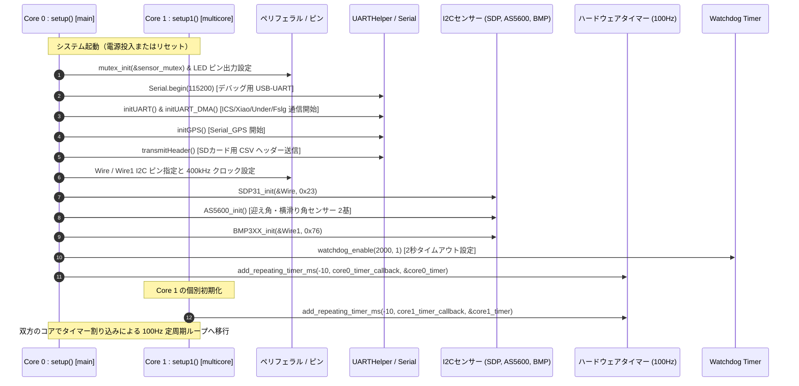
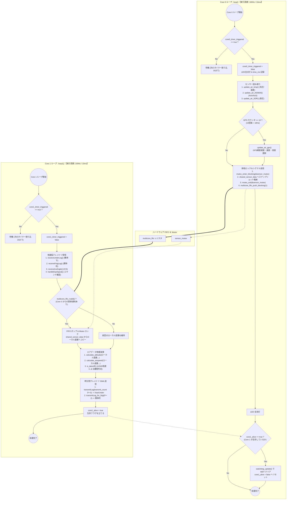

# RP2040 デュアルコア処理・タイマー割り込み＆タスクフロー

`26th_Air_Bico` プログラムでは、RP2040 の 2 つの CPU コア（Core 0 と Core 1）にタスクを完全に分離し、それぞれに対して独立した 100Hz（周期 10ms）のハードウェアタイマー割り込みを設定して定周期処理を行っています。

---

## 1. 初期化およびマルチコア起動シーケンス (`setup()` / `setup1()`)

システム起動時、Core 0 が最初に `setup()` を実行し、全ペリフェラルの構成、センサーの初期化、CSV ヘッダーの送信を行った後、ハードウェアタイマーおよび Watchdog を有効化します。 Core 1 は RP2040 の `pico/multicore` 機構によって自動起動され、並列で `setup1()` を実行します。

---

## 2. Core 0 vs Core 1 のタスクループフローチャートとコア間通信

タイマーコールバック関数 (`core0_timer_callback` / `core1_timer_callback`) が 10ms 毎にフラグ (`core0_timer_triggered` / `core1_timer_triggered`) を `true` にすることで、メインループ (`loop()` / `loop1()`) 内の定周期処理が起動します。

---

## 3. 設計上の特長と Watchdog による安全防護

### `add_repeating_timer_ms(-10, ...)` の「負の周期パラメータ」
- RP2040 の `pico/stdlib.h` タイマーにおいて、周期に負の数（例：`-10ms`）を指定すると、**「コールバックの処理完了にかかる時間に関わらず、前回の起動時刻を基準として正確に 10ms (100Hz) 間隔でタイマーを発火させる」** という定周期保証モードになります。これにより、計算や受信処理のゆらぎに影響されずにジッターのないサンプリングが可能となっています。

### デュアルコアクロス Watchdog 監視機構
- ESP32 などの一般的なマイコンではコア個別に WDT を持たせることが多いですが、本システムでは **「Core 0 と Core 1 がお互いを監視して初めて WDT がリフレッシュされる」** という高度な相互監視を行っています。
- Core 1 が 1 ループ実行するたびに `core1_alive = true` をセットします。
- Core 0 は自ループの最後で `core1_alive == true` を確認できた場合のみ `watchdog_update()` を実行して WDT カウンタを巻き戻し、`core1_alive = false` にリセットします。
- **効果**: もし Core 1 の UART 受信がハングアップしたり物理計算で無限ループに陥ったりした場合、Core 0 が正常に動いていても `watchdog_update()` が実行されなくなり、**2 秒経過すると自動的にシステム全体をリセット・再起動** させます。
