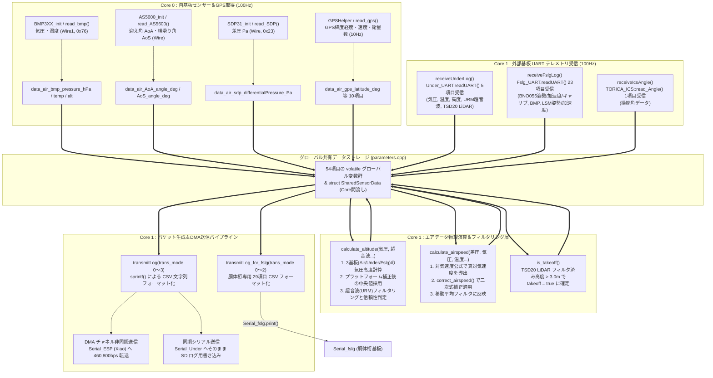

# データ受信・物理演算・送信パイプラインフロー

`26th_Air_Bico` は、自基板搭載の 4 基の I2C センサー、1 系統の GPS、および 3 つの外部基板（Under, 胴体桁, ICS）から集まる膨大な生データを統合・解析し、飛行に必須のエアデータ計算（高度・対気速度・離陸判定）を完了させた上で、地上親機（Xiao ESP32 S3）とストレージへ配信するパイプラインを構築しています。

---

## 1. データ収集・計算・出力の統合パイプラインフローチャート

---

## 2. 54項目データパケットのインデックス構成 (`struct LogData` / 4分割送信)

`26th_Air_Bico` は、毎回の送信でマイコンや UART DMA のバッファをあふれさせず、かつ各パケットのデータ長を均等化するため、54 項目のエアデータを **4 つの送信モード (`trans_mode = 0 〜 3`)** に分けて `Serial_ESP` および `Serial_Under` へ送信します。

| 送信モード (`trans_mode`) | 項目数 | データ内容とインデックス範囲 |
| :---: | :---: | :--- |
| **`case 0`** (計13項目) | 13個 | **システム時刻・離陸判定・GPS基本情報** `time_ms`, `takeoff`, `urm_is_reliable`, `data_air_gps_hour/minute/second/centisecond`, `data_air_gps_latitude/longitude/altitude`, `data_air_gps_groundspeed/heading/satellites` |
| **`case 1`** (計11項目) | 11個 | **フィルタ済みエアデータ・気圧・気流角・操舵角** `filtered_bmp_altitude_m`, `filtered_urm_altitude_m`, `filtered_airspeed_ms`, `data_air_bmp_pressure/temperature/altitude`, `data_air_sdp_differentialPressure/airspeed`, `data_air_AoA/AoS_angle_deg`, `data_ics_angle` |
| **`case 2`** (計14項目) | 14個 | **胴体桁生存ステータス・BNO055/LSM6DSV16X 姿勢角・気圧** `fslg_is_alive`, `data_fslg_bno_qw/qx/qy/qz`, `roll/pitch/yaw`, `data_fslg_lsm_roll/pitch/yaw`, `data_fslg_bmp_pressure/temperature/altitude` |
| **`case 3`** (計16項目) | 16個 | **加速度・IMU キャリブレーション・機体下基板データ** `data_fslg_bno_accx/accy/accz`, `lsm_accx/accy/accz`, `bno_cal_system/gyro/accel/mag`, `under_is_alive`, `data_under_bmp_pressure/temperature/altitude`, `under_urm_altitude_m`, `under_tsd20_altitude_m` |

---

## 3. CSV ヘッダー送信機構 (`transmitHeader()`) の工夫

`setup()` 内で実行される `transmitHeader()` は、上記 4 分割パケット・全 54 項目に対応するカンマ区切りの CSV 列見出し（文字列）を生成し、`Serial_ESP` (Xiao) および `Serial_Under` (SD書き込み用) に一括送信します。

### バッファ溢れ防止と時間遅延 (`delayMicroseconds(10)`)
- 54 個の変数名をカンマで繋ぐと数百バイトに達するため、一度に送信しようとすると RP2040 のハードウェア UART 送信 FIFO (デフォルト 32 バイト) が即座に満杯となり、文字欠けやパケット破損が発生します。
- これを防ぐため、`case 0` 〜 `case 3` の 4 ステップのループに分割して `sprintf` でフォーマットし、**各ステップの間で `Serial_Under.flush()` および `delayMicroseconds(10)` を挿入** することで、受信側（Xiao や Under 基板の SD 書き込み処理）が取りこぼすことなく安全に CSV ヘッダーを記録できるようにしています。
