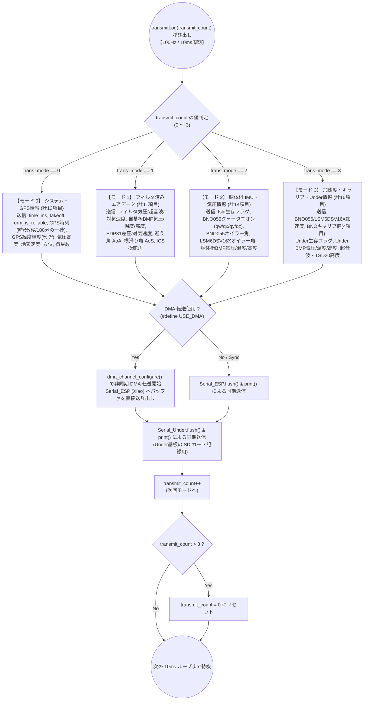
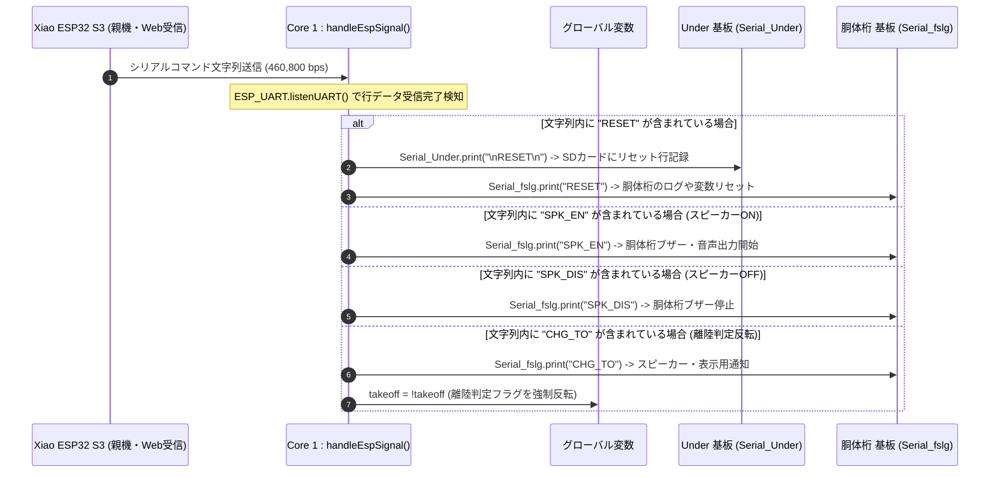
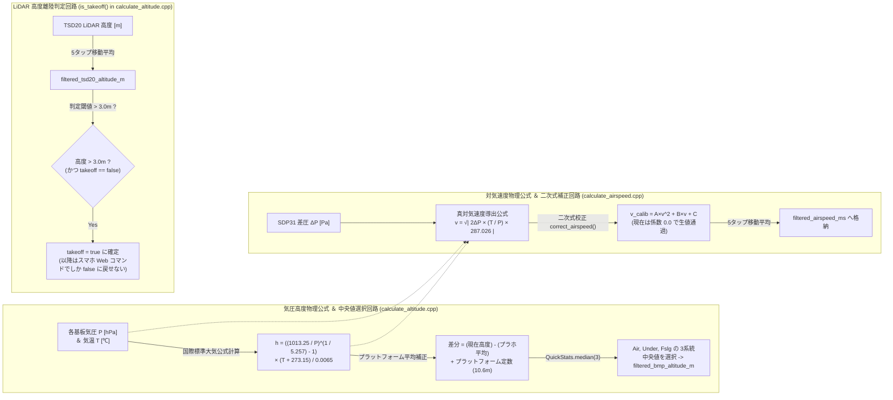

# 時分割パケット配信・コマンド制御・物理計算仕様

`26th_Air_Bico` は、地上モニタリング親機（Xiao ESP32 S3）との間で高速通信を行うとともに、Xiao 経由で受信した Web クライアントの制御コマンド（リセット、離陸判定切替、スピーカーON/OFF等）を解析し、各サブシステムへと分配する制御ハブ機能を持っています。また、飛行性能を左右する高度・対気速度の物理計算をリアルタイムに実行しています。

---

## 1. 4段階マルチプレクス時分割テレメトリ送信 (`transmitLog()`)

Core 1 は 100Hz (10ms 周期) のループ内で毎回 `transmitLog(transmit_count)` を呼び出し、静的変数 `transmit_count` をインクリメントしながら 4 分割されたデータグループ (`case 0` 〜 `case 3`) を順次 DMA 送信します。4 回でちょうど 1 サイクルの全 54 項目が送信完了します（全パケット送信周期 = 40ms / 25Hz）。

---

## 2. Xiao / Web クライアントからのコマンド制御シーケンス (`handleEspSignal()`)

Xiao ESP32 S3 から `Serial_ESP` (`Serial2` / `ESP_UART`) にシリアル文字が届くと、Core 1 の `handleEspSignal()` が内容をパースし、対応する動作や各サブシステムへのコマンド転送を実行します。

---

## 3. エアデータ物理計算式と回路・処理プロセス図

`26th_Air_Bico` の中核である「気圧高度」「対気速度」「離陸判定」は、複数のセンサーを組み合わせてフィルタリングを行うことでノイズを排除しています。

### 気圧高度計算公式 (`calculate_bmp_altitude`)
国際標準大気 (ISA) モデルの公式に基づき、各センサーの気圧 $P$ と温度 $T$ から標高 $h$ を算出します。
$$h = \frac{\left( \left( \frac{1013.25}{P} \right)^{\frac{1}{5.257}} - 1 \right) \times (T + 273.15)}{0.0065}$$
さらに、離陸前のプラットフォーム上で測定した 50 タップ平均との差を取り、プラットフォーム固有高度 $10.6\text{m}$ (`const_platform_altitude_m`) を加算。3 系統（Air, Under, Fslg）の中で中央値を取ることで、単一センサーの突発的なスパイクノイズを完全に遮断しています。

### 対気速度計算公式 (`calculate_airspeed`)
ベルヌーイの定理と気体の状態方程式に基づき、差圧 $\Delta P$、気圧 $P$、気温 $T$、気体定数 $R/M = 287.026 \text{ J/(kg} \cdot \text{K)}$ から速度 $v$ を導出します。
$$v = \sqrt{ \left| 2 \Delta P \times \frac{T + 273.15}{P \times 100} \times 287.026 \right| }$$
これにより、高高度で気温や気圧が変化しても正確な真対気速度を獲得できます。
