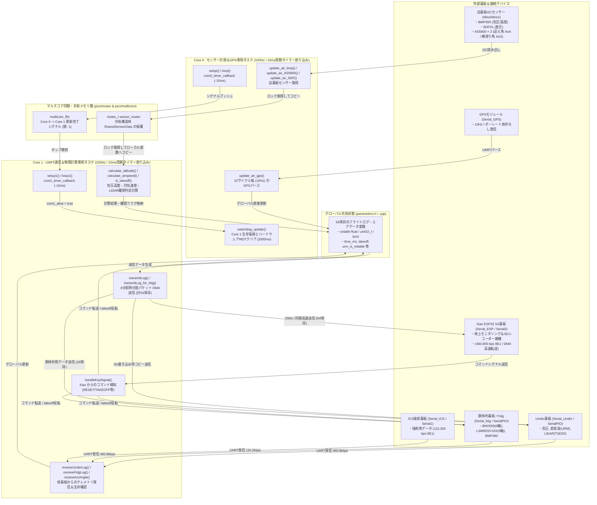
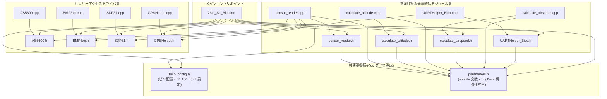
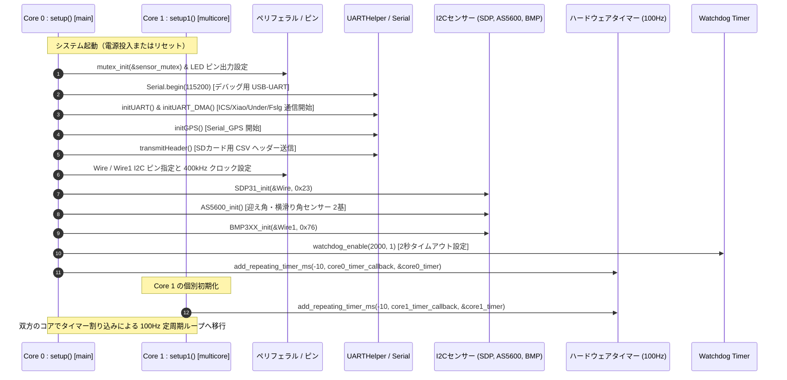
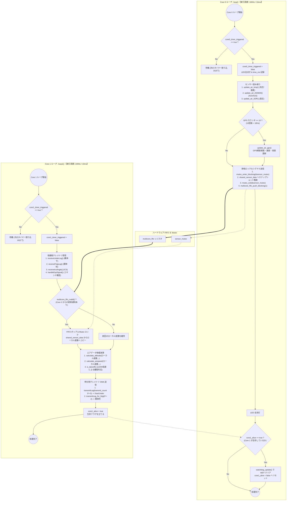
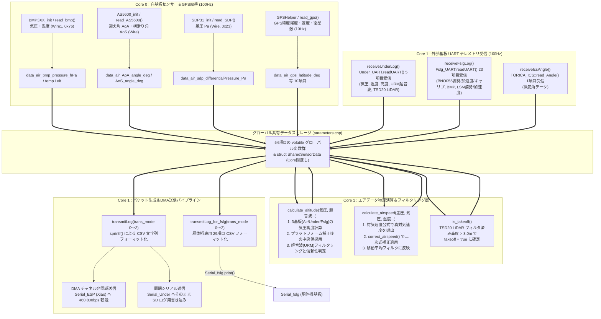
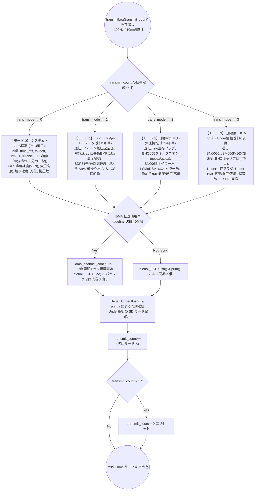
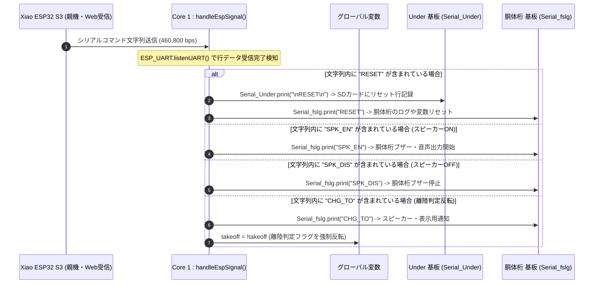
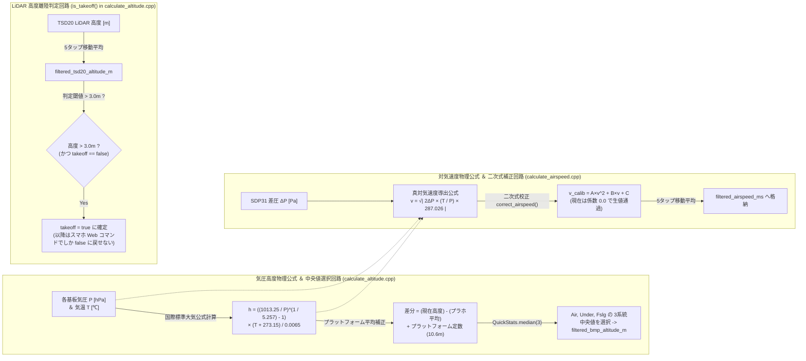

# draw.io 貼り付け専用 Mermaid スニペット集 (`26th_Air_Bico` / RP2040)

## 1. システム全体アーキテクチャ図 (`README.md`)



## 2. インクルード関係グラフ (`01_file_relationships.md`)



## 3. スレッドセーフデータ共有設計図 (`01_file_relationships.md`)

```mermaid
flowchart LR
    subgraph Core0_Task ["Core 0 タスク (I2C / GPS 読取)"]
        C0_Read["自基板センサー値の更新<br>data_air_bmp_pressure_hPa 等"]
        C0_Lock["mutex_enter_blocking(&sensor_mutex)"]
        C0_Copy["shared_sensor_data にスナップショットをコピー"]
        C0_Unlock["mutex_exit(&sensor_mutex)"]
        C0_Push["multicore_fifo_push_blocking(1)<br>シグナル送信"]
    end

    subgraph Shared_Memory ["共有メモリ保護領域"]
        Mutex["mutex_t sensor_mutex<br>(RP2040 ハードウェア Mutex)"]
        Shared_Struct["struct SharedSensorData<br>(気圧・温度・超音波・差圧スナップショット)"]
        FIFO["multicore_fifo<br>(コア間通信 FIFO レジスタ)"]
    end

    subgraph Core1_Task ["Core 1 タスク (UART / 物理計算)"]
        C1_Check{"multicore_fifo_rvalid() ?"}
        C1_Pop["multicore_fifo_pop_blocking()"]
        C1_Lock["mutex_enter_blocking(&sensor_mutex)"]
        C1_Copy["local_air_press 等のローカル変数へ安全コピー"]
        C1_Unlock["mutex_exit(&sensor_mutex)"]
        C1_Calc["calculate_altitude() / calculate_airspeed()<br>ローカル変数のみを引数に物理計算を実行"]
    end

    C0_Read --> C0_Lock --> C0_Copy --> C0_Unlock --> C0_Push
    C0_Copy ==> Shared_Struct
    C0_Lock -.-> Mutex
    C0_Unlock -.-> Mutex
    C0_Push ==> FIFO

    FIFO ==> C1_Check
    C1_Check -->|"Yes"| C1_Pop --> C1_Lock --> C1_Copy --> C1_Unlock --> C1_Calc
    C1_Check -->|"No (シグナルなし)"| C1_Calc
    C1_Copy <== Shared_Struct
    C1_Lock -.-> Mutex
    C1_Unlock -.-> Mutex
```

## 4. 初期化シーケンス図 (`02_core_tasks_flowchart.md`)



## 5. Core 0 vs Core 1 タスクループフローチャート (`02_core_tasks_flowchart.md`)



## 6. データパイプライン関数呼び出しフロー図 (`03_data_pipeline_flowchart.md`)



## 7. 時分割テレメトリ送信条件分岐図 (`04_web_command_flowchart.md`)



## 8. コマンド制御シーケンス図 (`04_web_command_flowchart.md`)



## 9. 電圧・電流計測及び物理計算回路図 (`04_web_command_flowchart.md`)



## 10. 4層レイヤー構造・関数ヒエラルキーと処理関係図 (`06_layer_hierarchy_flowchart.md`)

```mermaid
flowchart TD
    subgraph L3 ["【Layer 3】 抽象データロジック＆物理演算層 (ハードウェア非依存)"]
        L3_Struct["struct LogData ＆ volatile 共有グローバル変数群<br>(計54項目のフライトログデータ)"]
        L3_Shared["struct SharedSensorData<br>(気圧・温度・超音波・差圧スナップショット)"]
        L3_Alt["calculate_altitude() / calculate_bmp_altitude()<br>国際標準大気公式による気圧高度計算＆中央値選択"]
        L3_Spd["calculate_airspeed() / correct_airspeed()<br>ベルヌーイ公式による真対気速度計算＆二次補正"]
        L3_TO["is_takeoff()<br>TSD20 LiDAR 高度移動平均による離陸確定判定"]
    end

    subgraph L2 ["【Layer 2】 中間ラッパー＆タスク・マルチコア同期制御層"]
        L2_C0["loop() / core0_timer_callback()<br>Core 0 100Hz ループ制御"]
        L2_UpSens["update_air_bmp() / AS5600() / SDP() / gps()<br>自基板センサー読取・同期統括"]

        L2_Sync["multicore_fifo_push / pop_blocking()<br>コア間更新シグナル受け渡し"]

        L2_C1["loop1() / core1_timer_callback()<br>Core 1 100Hz ループ制御"]
        L2_RxUART["receiveUnderLog() / FslgLog() / IcsAngle()<br>他基板からの受信パース・生存判定"]
        L2_Cmd["handleEspSignal()<br>Xiao からのシリアルコマンド検知・転送"]
        L2_Tx["transmitLog() / transmitLog_for_fslg()<br>54項目 4分割 CSV フォーマット化"]
    end

    subgraph L1 ["【Layer 1】 ハードウェアドライバ＆ペリフェラルアクセス層"]
        L1_Sens["read_bmp() / read_AS5600() / read_SDP() / read_gps()<br>I2C・UART 経由の生データ取得"]
        L1_UART_Rx["TORICA_UART::readUART() / listenUART() / TORICA_ICS::read_Angle()<br>UART フレーム受信・文字列バッファ解析"]
        L1_Init["initUART() / initUART_DMA() / transmitHeader()<br>通信ペリフェラル初期化＆CSVヘッダー一括送信"]
        L1_WDT["watchdog_update()<br>ハードウェア WDT カウンタクリア"]
    end

    subgraph L0 ["【Layer 0】 物理ハードウェア＆RP2040 OS/カーネルプリミティブ"]
        L0_HW["RP2040 デュアルコア CPU (Core 0 / Core 1)<br>& 物理ピン (Wire:SDA20/SCL21, Wire1:SDA26/SCL27, UART1/2, SerialPIO)"]
        L0_Sync_HW["ハードウェア Mutex (sensor_mutex)<br>& multicore_fifo レジスタ & 100Hz ハードウェアタイマー"]
        L0_DMA["RP2040 DMA コントローラ (DREQ_UART1_TX)<br>& Watchdog ハードウェア (2000ms)"]
    end

    L2_C0 -->|"タイマー駆動"| L2_UpSens
    L2_UpSens -->|"ドライバ呼び出し"| L1_Sens
    L1_Sens --- L0_HW
    L2_UpSens -->|"ロック・コピー"| L3_Shared
    L2_UpSens -->|"シグナルプッシュ"| L2_Sync
    L2_Sync --- L0_Sync_HW
    L2_C0 -->|"core1_alive 確認で WDT リフレッシュ"| L1_WDT
    L1_WDT --- L0_DMA

    L2_C1 -->|"タイマー駆動"| L2_RxUART
    L2_C1 -->|"コマンド検知"| L2_Cmd
    L2_RxUART & L2_Cmd -->|"ドライバ呼び出し"| L1_UART_Rx
    L1_UART_Rx --- L0_HW
    L2_RxUART -->|"受信データ反映"| L3_Struct

    L2_C1 -->|"FIFOチェック・ポップ"| L2_Sync
    L2_C1 -->|"共有データから安全コピー"| L3_Shared
    L2_C1 -->|"計算指示"| L3_Alt & L3_Spd & L3_TO
    L3_Alt & L3_Spd & L3_TO -->|"計算結果・フラグ代入"| L3_Struct

    L2_C1 -->|"送信生成"| L2_Tx
    L2_Tx -->|"グローバル参照"| L3_Struct
    L2_Tx -->|"DMA非同期 / 同期転送指示"| L0_DMA & L0_HW
```


