# ソフトウェアレイヤー構造・関数ヒエラルキーと処理関係

本ドキュメントでは、`26th_Air_Bico` (RP2040) プロジェクトにおける各関数が「物理デバイスやペリフェラルレジスタに近い低レイヤー関数」なのか、「マルチコア間同期やタイマー駆動を行う中間タスクラッパーなのか」、「物理計算や抽象化された変数展開を担う高レイヤー抽象関数なのか」を明確に分類した階層（ヒエラルキー）図と、階層間での呼び出し・データアクセス関係を解説します。

---

## 1. 4層レイヤー階層（ヒエラルキー）の定義と役割

| 階層 | レイヤー名 | 役割・責務 | 該当する主なモジュール・関数・変数 |
| :---: | :--- | :--- | :--- |
| **Layer 3** | **抽象データロジック層** *(Abstracted Data Layer)* | ハードウェア通信やコアの違いを意識せず、純粋な大気物理計算（気圧高度・対気速度・離陸判定）と共有データの保持を行う抽象ロジック層 | `calculate_altitude()`, `calculate_airspeed()`, `calculate_bmp_altitude()`, `correct_airspeed()`, `is_takeoff()`, `struct LogData`, `struct SharedSensorData`, 54個の `volatile` グローバル変数 |
| **Layer 2** | **中間ラッパー＆タスク・同期制御層** *(Task Wrapper / Multicore Sync)* | 100Hz 割り込みコールバックによるタスクループの実行、Mutex ロック・FIFO ポップ等のコア間調停、通信ドライバと抽象ロジックの橋渡し | `loop()`, `loop1()`, `core0_timer_callback()`, `core1_timer_callback()`, `update_air_bmp/AS5600/SDP/gps()`, `receiveUnderLog/FslgLog/IcsAngle()`, `handleEspSignal()`, `transmitLog()`, `transmitLog_for_fslg()` |
| **Layer 1** | **ハードウェアドライバ＆ペリフェラル制御層** *(Hardware Driver Layer)* | I2C / UART / DMA ペリフェラルの初期化、センサーレジスタからの生値読み取り、CSV ヘッダー生成、Watchdog の直接更新 | `initUART()`, `initUART_DMA()`, `initGPS()`, `transmitHeader()`, `BMP3XX_init/read_bmp()`, `SDP31_init/read_SDP()`, `AS5600_init/read_AS5600()`, `read_gps()`, `TORICA_UART::readUART()`, `watchdog_update()` |
| **Layer 0** | **物理ハードウェア＆RP2040 カーネルプリミティブ** *(Physical Hardware / Kernel)* | デュアルコア CPU、物理ピン、ハードウェアタイマー、DMA コントローラ、ハードウェア Mutex、FIFO などの低レイヤーリソース | RP2040 (`Core 0` / `Core 1`), GPIO/LEDピン, `Wire` (`I2C0`), `Wire1` (`I2C1`), `Serial1/2`, `SerialPIO`, ハードウェア Mutex (`sensor_mutex`), `multicore_fifo`, `add_repeating_timer_ms`, `dma_channel_configure` |

---

## 2. ソフトウェアレイヤーヒエラルキー＆統合呼び出し関係図

以下の図は、上段から下段に向かって**抽象度の高さ（上：高レイヤー・純粋物理演算 ⇔ 下：低レイヤー・物理ペリフェラル）** を配置し、各処理がどの階層から呼び出され、どこにデータパスが通っているかを明示しています。

```mermaid
flowchart TD
    subgraph L3 ["【Layer 3】 抽象データロジック＆物理演算層 (ハードウェア非依存)"]
        L3_Struct["struct LogData ＆ volatile 共有グローバル変数群<br>(計54項目のフライトログデータ)"]
        L3_Shared["struct SharedSensorData<br>(気圧・温度・超音波・差圧スナップショット)"]
        L3_Alt["calculate_altitude() / calculate_bmp_altitude()<br>国際標準大気公式による気圧高度計算＆中央値選択"]
        L3_Spd["calculate_airspeed() / correct_airspeed()<br>ベルヌーイ公式による真対気速度計算＆二次補正"]
        L3_TO["is_takeoff()<br>TSD20 LiDAR 高度移動平均による離陸確定判定"]
    end

    subgraph L2 ["【Layer 2】 中間ラッパー＆タスク・マルチコア同期制御層"]
        L2_C0["loop() / core0_timer_callback()<br>Core 0 100Hz ループ制御"]
        L2_UpSens["update_air_bmp() / AS5600() / SDP() / gps()<br>自基板センサー読取・同期統括"]

        L2_Sync["multicore_fifo_push / pop_blocking()<br>コア間更新シグナル受け渡し"]

        L2_C1["loop1() / core1_timer_callback()<br>Core 1 100Hz ループ制御"]
        L2_RxUART["receiveUnderLog() / FslgLog() / IcsAngle()<br>他基板からの受信パース・生存判定"]
        L2_Cmd["handleEspSignal()<br>Xiao からのシリアルコマンド検知・転送"]
        L2_Tx["transmitLog() / transmitLog_for_fslg()<br>54項目 4分割 CSV フォーマット化"]
    end

    subgraph L1 ["【Layer 1】 ハードウェアドライバ＆ペリフェラルアクセス層"]
        L1_Sens["read_bmp() / read_AS5600() / read_SDP() / read_gps()<br>I2C・UART 経由の生データ取得"]
        L1_UART_Rx["TORICA_UART::readUART() / listenUART() / TORICA_ICS::read_Angle()<br>UART フレーム受信・文字列バッファ解析"]
        L1_Init["initUART() / initUART_DMA() / transmitHeader()<br>通信ペリフェラル初期化＆CSVヘッダー一括送信"]
        L1_WDT["watchdog_update()<br>ハードウェア WDT カウンタクリア"]
    end

    subgraph L0 ["【Layer 0】 物理ハードウェア＆RP2040 OS/カーネルプリミティブ"]
        L0_HW["RP2040 デュアルコア CPU (Core 0 / Core 1)<br>& 物理ピン (Wire:SDA20/SCL21, Wire1:SDA26/SCL27, UART1/2, SerialPIO)"]
        L0_Sync_HW["ハードウェア Mutex (sensor_mutex)<br>& multicore_fifo レジスタ & 100Hz ハードウェアタイマー"]
        L0_DMA["RP2040 DMA コントローラ (DREQ_UART1_TX)<br>& Watchdog ハードウェア (2000ms)"]
    end

    %% --- 呼び出し・アクセス関係 ---

    %% Core 0 の流れ
    L2_C0 -->|"タイマー駆動"| L2_UpSens
    L2_UpSens -->|"ドライバ呼び出し"| L1_Sens
    L1_Sens --- L0_HW
    L2_UpSens -->|"ロック・コピー"| L3_Shared
    L2_UpSens -->|"シグナルプッシュ"| L2_Sync
    L2_Sync --- L0_Sync_HW
    L2_C0 -->|"core1_alive 確認で WDT リフレッシュ"| L1_WDT
    L1_WDT --- L0_DMA

    %% Core 1 の流れ
    L2_C1 -->|"タイマー駆動"| L2_RxUART
    L2_C1 -->|"コマンド検知"| L2_Cmd
    L2_RxUART & L2_Cmd -->|"ドライバ呼び出し"| L1_UART_Rx
    L1_UART_Rx --- L0_HW
    L2_RxUART -->|"受信データ反映"| L3_Struct

    L2_C1 -->|"FIFOチェック・ポップ"| L2_Sync
    L2_C1 -->|"共有データから安全コピー"| L3_Shared
    L2_C1 -->|"計算指示"| L3_Alt & L3_Spd & L3_TO
    L3_Alt & L3_Spd & L3_TO -->|"計算結果・フラグ代入"| L3_Struct

    L2_C1 -->|"送信生成"| L2_Tx
    L2_Tx -->|"グローバル参照"| L3_Struct
    L2_Tx -->|"DMA非同期 / 同期転送指示"| L0_DMA & L0_HW
```

---

## 3. レイヤー分離による設計メリット

1. **Layer 3（抽象データロジック層）の再利用性と堅牢性**
   - 気圧や差圧が I2C センサーから来たのか、他基板の UART から来たのかを Layer 3 は一切意識せず、引数として与えられた `float` 変数のみに基づいて純粋な大気物理計算 (`calculate_altitude` / `calculate_airspeed`) を実行します。これにより、ハードウェアピンの変更が計算公式に悪影響を及ぼすことがありません。
2. **Layer 2（タスク・同期制御層）によるコア間データ破損の完全防止**
   - デュアルコアで最大の弱点であるデータ競合に対し、Layer 2 が `sensor_mutex` と `multicore_fifo` という Layer 0 レジスタを巧みに操ることで、Core 0 がセンサーを読んでいる最中に Core 1 が計算を開始するような不具合を完全に排除しています。
3. **Layer 1（ドライバ層）によるカプセル化**
   - センサーの I2C アドレス指定 (`0x76` や `0x23`)、DMA の 1 バイトインクリメント設定、NMEA 文字列パースなどを Layer 1 の関数群 (`read_bmp()` や `initUART_DMA()`) が担うことで、メインの `loop()` / `loop1()` が非常に可読性の高いシンプルな構造に保たれています。
