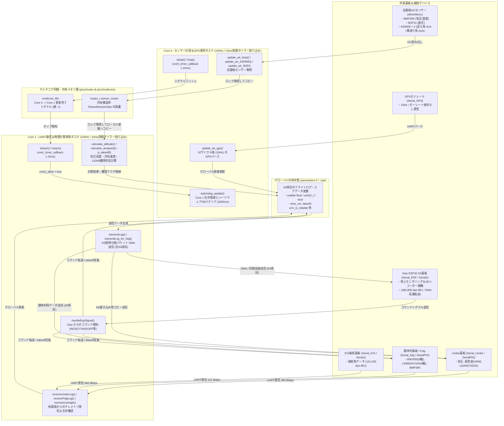

# 26th_Air_Bico (RP2040) ソフトウェア仕様書（メインコントローラー＆エアデータ計算ハブ）

本 `docs` ディレクトリには、鳥人間コンテスト26代機体エアデータシステムの中核を担うメインコントローラー基板 **`26th_Air_Bico` (デュアルコア RP2040 / Raspberry Pi Pico / Pico W 向け)** の全容・ファイル構成・マルチコア同期・物理計算仕様を網羅した仕様書と、draw.io にそのまま貼り付け可能な Mermaid 形式の図解を収録しています。

---

## 1. ドキュメント構成（目次）

本ドキュメントは以下の6部構成（＋draw.io貼り付け用コード集の全7ファイル）となっています。各Markdownファイル内で詳細なMermaidチャートと技術解説を記述しています。

| ファイル名 | タイトル | 概要 |
| :--- | :--- | :--- |
| **[`01_file_relationships.md`](01_file_relationships.md)** | **ファイル構成とインクルード依存グラフ** | 各 `.ino`, `.h`, `.cpp` ファイルの個別責務、インクルード関係、および `parameters.h` や `SharedSensorData` 構造体・Mutex を用いたスレッドセーフなデータ共有設計 |
| **[`02_core_tasks_flowchart.md`](02_core_tasks_flowchart.md)** | **RP2040 デュアルコア処理＆同期フロー** | Core 0（センサー取得・GPS受信）と Core 1（UART通信・物理計算）のタイマー割り込み駆動（100Hz）、ハードウェア Mutex・FIFO 同期、および Watchdog 監視機構 |
| **[`03_data_pipeline_flowchart.md`](03_data_pipeline_flowchart.md)** | **データ受信・計算・パケット送信パイプライン** | 自基板センサー・機体下基板・胴体桁基板・ICS基板からのデータ統合から、高度・対気速度・離陸判定計算、4分割パケット DMA 送信（54項目）までの処理連携 |
| **[`04_web_command_flowchart.md`](04_web_command_flowchart.md)** | **時分割テレメトリ・コマンド制御・物理計算仕様** | 4段階マルチプレクス送信のデータ配分、Xiao ESP32 S3 からのコマンド（`RESET`, `CHG_TO`, `SPK_EN/DIS` 等）の処理シーケンス、気圧高度・対気速度物理計算式 |
| **[`06_layer_hierarchy_flowchart.md`](06_layer_hierarchy_flowchart.md)** | **4層レイヤー構造＆関数ヒエラルキー** | 全関数・変数を「物理I/O・ハードウェアドライバ・マルチコア同期ラッパー・抽象データロジック」の4階層へ分類し、レイヤー間でのデータパスを明示した設計書 |
| **[`05_drawio_mermaid_snippets.md`](05_drawio_mermaid_snippets.md)** | **draw.io用貼り付けコード＆インポート手順** | draw.io (app.diagrams.net) の Mermaid インポート機能に完全対応し、構文エラーなしで1クリック貼り付け可能な純粋な図解コード集（全7図解） |

---

## 2. システム全体の概要（全体アーキテクチャ）

`26th_Air_Bico` は、機体各所に分散したセンサーサブシステム（機体下電装、胴体桁電装、ICS操舵基板、GPS、自基板搭載気圧・差圧・迎え角センサー）から全データを収集し、物理計算および状態判定を行って地上モニタリング親機（Xiao ESP32 S3）およびストレージへリアルタイム配信する **「メインコントローラーハブ」** です。

RP2040 のマルチコア機能とハードウェアタイマーを最大限に生かし、**「Core 0：高精度センサー計測＆GPSパース」** と **「Core 1：複数系統 UART 高速送受信＆物理演算」** を役割分担させています。また、コア間の共有データ競合を防ぐため、`mutex_t` による排他制御とハードウェア FIFO バッファによる同期シグナル伝達を導入しています。

---

## 3. コア別タスクと割り込み処理のまとめ

| コア | エントリ関数 | 動作周期 | タスクの責務・概要 |
| :---: | :--- | :---: | :--- |
| **Core 0** | `setup()` `loop()` | **100Hz (10ms)** `core0_timer` 割り込み | 1. **自基板I2Cセンサー読み取り**: BMP390 (`Wire1`), AS5600×2 (`Wire`), SDP31 (`Wire`) を 100Hz で計測。 2. **GPSデータ取得**: 10サイクルに1回（10Hz）、`update_air_gps()` で緯度経度・高度・速度等を更新。 3. **マルチコア同期＆監視**: `sensor_mutex` を取得して `shared_sensor_data` へコピーし、FIFO にシグナルを送信。同時に `core1_alive` を確認して WDT（ウォッチドッグタイマー）をリフレッシュ。 |
| **Core 1** | `setup1()` `loop1()` | **100Hz (10ms)** `core1_timer` 割り込み | 1. **他基板 UART テレメトリ受信**: `receiveUnderLog` (Under), `receiveFslgLog` (胴体桁), `receiveIcsAngle` (ICS) を呼び出し、1秒タイムアウトで生存判定フラグを更新。 2. **物理計算**: FIFO シグナル受信時に共有データをローカルにコピーし、`calculate_altitude()`（3基板気圧高度中央値・超音波処理）、`calculate_airspeed()`（差圧平方根・二次式補正）、`is_takeoff()`（LiDAR高度判定）を実行。 3. **テレメトリ配信＆コマンド処理**: `transmitLog(0〜3)` で 54 項目を 4 分割して Xiao・Under へ DMA 送信。また Xiao からの `RESET`/`CHG_TO` 等のコマンド (`handleEspSignal`) を検知し他基板やシステム全体へ反映。 |
