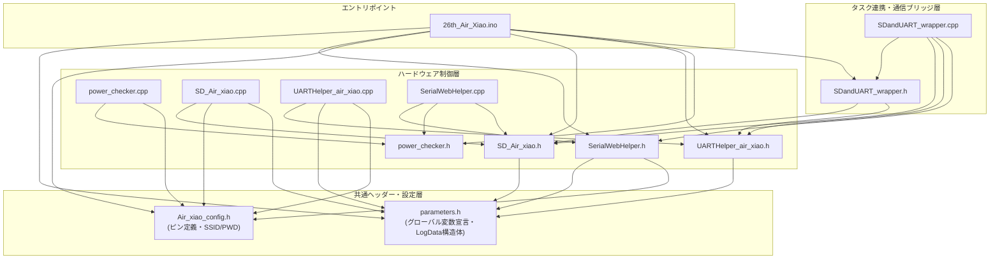

# ファイル間関係とモジュール構成

本ドキュメントでは、`26th_Air_Xiao` プロジェクトを構成する全ソースファイル（`.ino`, `.h`, `.cpp`）の役割と、ファイル間の依存関係（インクルードグラフ）、データ保持の構造について解説します。

---

## 1. ファイル構成一覧と役割概要

| ファイル名 | 分類 | 主な責務・役割 |
| :--- | :--- | :--- |
| **`26th_Air_Xiao.ino`** | メインプログラム | ・FreeRTOSタスク (`Core0_Task`, `Core1_Task`) の生成・割当 ・各モジュール（SD, UART, 電圧電流, Wi-Fi）の初期化 (`setup()`) ・Wi-Fi AP自己修復処理 (`checkAndRecoverWiFiAP()`) およびデバッグ用統計表示 |
| **`SDandUART_wrapper.h / .cpp`** | ラッパー・コア間通信 | ・FreeRTOSキュー (`uartQueue`, `sdQueue`) を用いた Core 0 と Core 1 のタスク連携 ・`processCore0_ParseAndWeb()`, `processCore1_ListenUART()`, `processCore1_WriteSD()` の実行 |
| **`UARTHelper_air_xiao.h / .cpp`** | UART通信・データ変換 | ・`Serial1` (460,800 bps, 8E1) での Bico基板とのシリアル通信管理 (`TORICA_UART`) ・受信した 54個の float配列 (`Bico_UART.UART_data`) の `LogData` 構造体変換 (`convertArrayToLogData()`) ・グローバル変数への一括代入 (`applyLogDataToGlobals()`) と生存判定 (`Bico_is_alive`) |
| **`SD_Air_xiao.h / .cpp`** | SDカードログ保存 | ・SPI接続の microSDカード制御 (`TORICA_SD sd`) ・CSVヘッダーの自動書き込み (`flashHeader()`) と、受信データの文字列追記・フラッシュ (`writeBufToSD()`, `writeSD()`, `flashSD()`) |
| **`SerialWebHelper.h / .cpp`** | Wi-Fiテレメトリ・Web配信 | ・Wi-Fi Access Point (`SSID: SerialWeb`) を経由した地上モニタリング画面へのリアルタイム通信 ・10グループ分割の時分割テレメトリ送信 (`sendSerialWeb()`) ・Webクライアントからのリセット／離陸フラグ変更コマンドの受信と転送 (`SerialWeb_detectRESET()`) |
| **`power_checker.h / .cpp`** | 電圧・電流計測 | ・ESP32の ADC (`analogReadMilliVolts()`) によるバッテリー電圧（分圧回路：D2ピン）および負荷電流（LT6106電流計：D1ピン）の正確な計算 (`read_voltage_V()`, `read_current_mA()`) |
| **`parameters.h / .cpp`** | 共有データ定義 | ・システム全体で共有する 54項目のエアデータ・フライトログ用 `volatile` グローバル変数の宣言と定義 ・ログ用構造体 `struct LogData` の定義 |
| **`Air_xiao_config.h / .cpp`** | ピン・ハードウェア設定 | ・XIAO ESP32 S3 のピン割り当て定義（UART RX/TX, SPI SD_CS/SCK/MOSI/MISO, 電圧電流計ピン） ・Wi-Fi接続用 SSID とパスワード設定 |

---

## 2. ファイル間の依存関係（インクルードグラフ）

各ファイルがどのファイルを読み込み、どのように連携しているかをMermaidの結合図で示します。

---

## 3. グローバル変数と構造体のデータ共有設計 (`parameters.h` / `.cpp`)

本システムでは、マルチスレッド環境下でのメモリアクセスの安全性を保ちつつ、リアルタイム性を維持するために、以下のような階層的なデータ保持設計を採用しています。

1. **`volatile` グローバル変数 (`parameters.cpp`)**
   - 割り込みや別コアからの更新に即座に反応できるよう `volatile` 修飾されています。
   - `takeoff`（離陸状態）, `time_ms`（システム時間）, 気圧高度、対気速度、AoA/AoS、GPS座標、IMU 6軸姿勢角（BNO055 / LSM6DSV16X）、超音波／TSD20高度など、合計 **54個のテレメトリデータ** とステータスフラグが定義されています。

2. **`struct LogData` 構造体 (`parameters.h`)**
   - UART で一度の通信サイクル（全4回分割受信＝54項目）が完了した際、すべてのデータをひとまとめにして格納・やり取りするためのデータコンテナです。
   - `UARTHelper_air_xiao.cpp` で受信した float型配列のデータを `convertArrayToLogData()` 関数で構造体にまとめ、その後 `applyLogDataToGlobals()` でグローバル変数へ一括で反映させます。

3. **Core 0 と Core 1 におけるアクセス分離**
   - **Core 1** は、データの中身を一切パース・計算せず、Bico から受信した **「文字列行（`\n`区切り）」のまま SD カードへ書き込み** ます。これにより SD カード書き込み時のパース遅延やメモリロックを回避しています。
   - **Core 0** は、Core 1 からキューで受け取った文字列をゆっくり（約1秒毎に1回）パースし、グローバル変数を更新した上で `SerialWeb` の Wi-Fi パケットとして組み立てて送信します。
