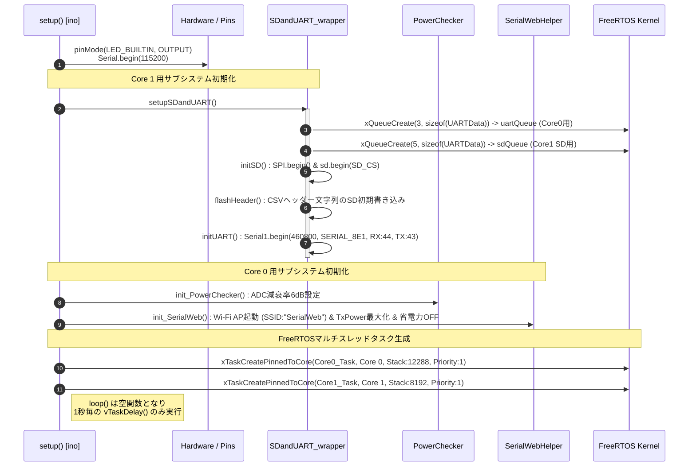
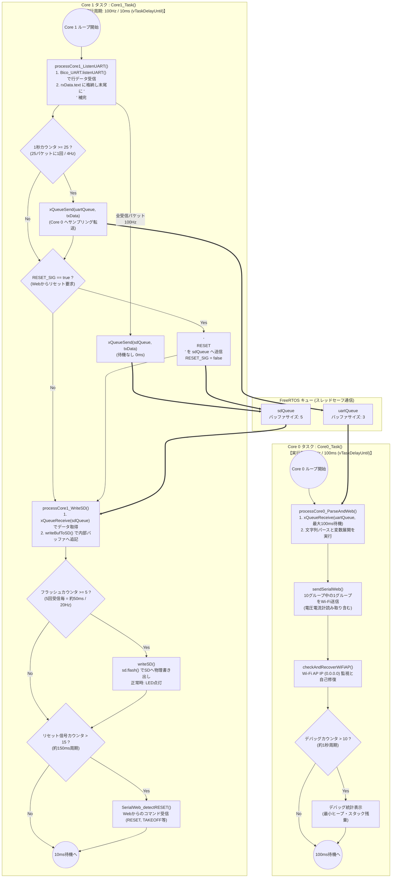

# マルチコア処理・FreeRTOSタスクフロー

本ドキュメントでは、XIAO ESP32 S3 で動作する FreeRTOS マルチスレッド構成の初期化（`setup()`）から、Core 0 および Core 1 に割り当てられた独立タスクの内部ループ構造、キューによるコア間通信の詳細を解説します。

---

## 1. システム初期化・タスク起動フロー (`setup()`)

プログラム起動時、`26th_Air_Xiao.ino` の `setup()` 関数が実行され、ハードウェアピンの初期化、ペリフェラル（SDカード・UART・ADC・Wi-Fi AP）の設定が行われた後、2つの FreeRTOS タスクが異なる CPU コアに固定（Pinned）して生成されます。

---

## 2. Core 0 vs Core 1 の処理フローチャートとキュー間通信

XIAO ESP32 S3 は、高負荷な「SDカードへの物理書き込み・UART受信」を Core 1 で専有させ、遅延や処理時間のゆらぎが大きい「文字列の浮動小数点パース・Wi-Fi通信」を Core 0 で行うことで、データ欠損のない堅牢なフライトレコーダーを実現しています。

---

## 3. タスクパラメータと設計上の工夫

- **スタックサイズとヒープメモリ保護**
  - ESP32 S3 の FreeRTOS は十分なスタックサイズが要求されます。`Core0_Task`（文字列解析・Wi-Fi）には `12288 バイト`、`Core1_Task`（SPI通信・UART）には `8192 バイト` のスタックが割り振られています。
  - キュー (`uartQueue`, `sdQueue`) に入る構造体 `UARTData` は `2048 バイト` のテキストバッファ (`char text[2048]`) を持つため、キューの深さをそれぞれ `3` と `5` に抑え、SRAM の枯渇（ヒープオーバーフロー）を防いでいます。

- **`vTaskDelayUntil` による定周期保証**
  - 通常の `vTaskDelay` では関数の実行時間分だけ次の周期が後ろにズレていきますが、本コードでは `vTaskDelayUntil` を使用し、タスクの開始時刻を基準とした **正確な 10ms / 100ms 周期** で処理を回しています。
