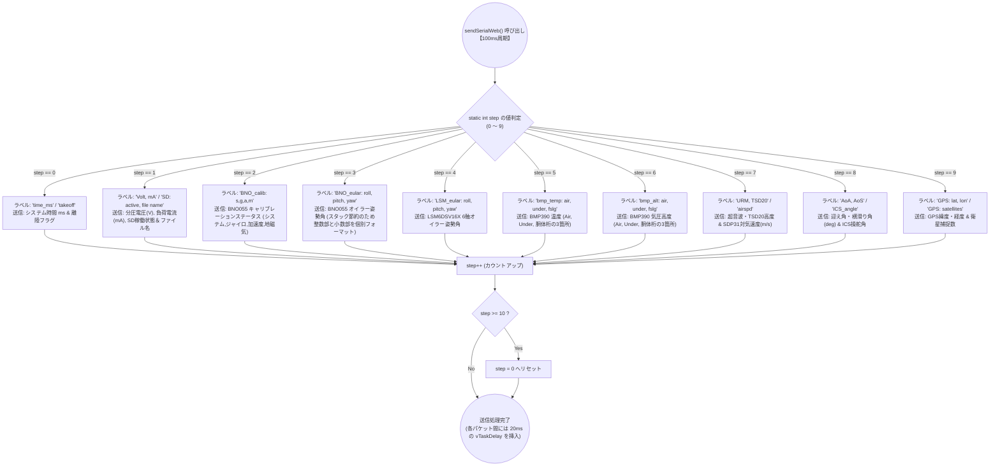
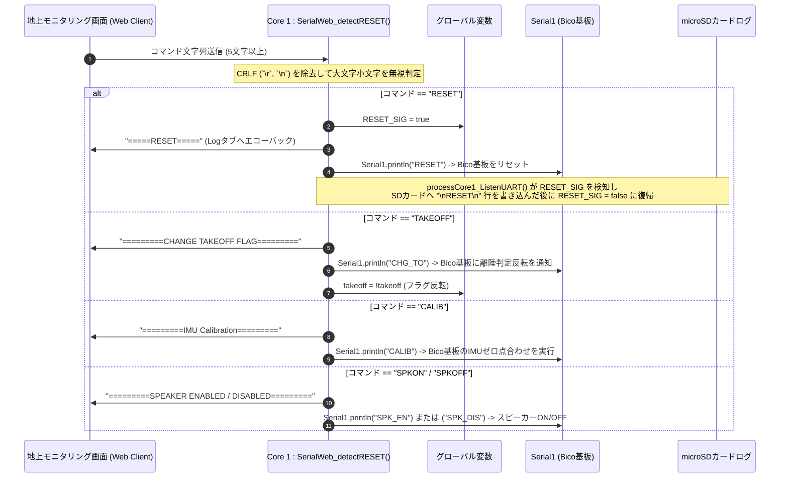
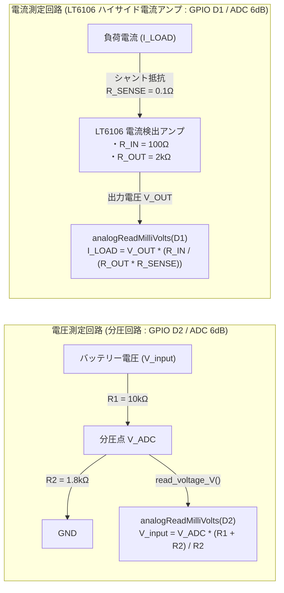

# SerialWeb通信・コマンド制御・電力計測

本ドキュメントでは、XIAO ESP32 S3 が提供する Wi-Fi Access Point (`SSID: SerialWeb`) を介したテレメトリデータの時分割マルチプレクス送信 (`sendSerialWeb()`) と、Webクライアント側からの制御コマンド受信 (`SerialWeb_detectRESET()`)、および搭載されている電流・電圧センサ計 (`power_checker`) の仕組みを解説します。

---

## 1. 10ステップ時分割マルチプレクス送信フロー (`sendSerialWeb()`)

ESP32 S3 から Wi-Fi 経由で大量の文字列データを一度にバースト送信すると、ネットワーク輻輳やスタックオーバーフロー、パケットドロップが発生する危険性があります。
これを防ぐため、`SerialWebHelper.cpp` の `sendSerialWeb()` では、10Hz (100ms周期) で動作する Core 0 タスクの中で、**「1回のタスク実行につき 1グループ（ステップ 0～9）のデータだけを順番に送信する時分割方式（マルチプレクサ）」** を採用しています。全10ステップが1秒間に1サイクルのペースで一巡します。

---

## 2. Webクライアントからのコマンド受信＆制御フロー (`SerialWeb_detectRESET()`)

Core 1 タスクでは、15サイクル (約150ms) おきに `SerialWeb.available()` がチェックされ、地上端末（PC・スマートフォン）の Web GUI から送信された文字列コマンドをトリム＆パースして、即座にマイコン変数や Bico 基板へ反映します。

---

## 3. Wi-Fi AP 自己修復機構 (`checkAndRecoverWiFiAP()`)

フライト中の電波干渉や電圧変動により Wi-Fi Access Point がハングアップした場合に備え、Core 0 タスクは `loop()` 代わりの無限ループ内で毎回 `checkAndRecoverWiFiAP()` を呼び出しています。

1. `WiFi.softAPIP()` で自機の AP IP アドレスを確認します。
2. もし IP アドレスが `0.0.0.0` にダウンしていた場合、以下を自動実行して通信を完全復旧させます。
   - `WiFi.softAPdisconnect(true)` で Wi-Fi スタックを一度リセット
   - `WiFi.mode(WIFI_AP)` に明示設定
   - `WiFi.softAP(SSID, PASSWORD, 1, 0, 1)` で AP を再構築（SSID: `SerialWeb` / CH: 1 / 最大接続: 1）
   - `WiFi.setSleep(false)` および `esp_wifi_set_ps(WIFI_PS_NONE)` を再適用し、省電力スリープによる遅延やパケット詰まりを排除。

---

## 4. 電圧・電流計測回路と計算式 (`power_checker.cpp`)

XIAO ESP32 S3 に接続されたアナログピンを介して、機体の電源系統の監視（バッテリー電圧および消費電流の測定）を行っています。

- **ADC減衰率設定** : `init_PowerChecker()` において `analogSetAttenuation(ADC_6db)` を設定し、ESP32のミリボルト読み取り精度を最大化しています。
- **電圧算出関数 (`read_voltage_V()`)**
  $$V_{\text{bat}} = V_{\text{ADC}} \times \frac{R_1 + R_2}{R_2} = V_{\text{ADC}} \times \frac{10\text{k}\Omega + 1.8\text{k}\Omega}{1.8\text{k}\Omega}$$
- **電流算出関数 (`read_current_mA()`)**
  $$I_{\text{load}} (\text{A}) = V_{\text{out}} \times \frac{R_{\text{in}}}{R_{\text{out}} \times R_{\text{sense}}} = V_{\text{out}} \times \frac{100\Omega}{2000\Omega \times 0.1\Omega} = V_{\text{out}} \times 0.5$$
  これを $\times 1000$ して $\text{mA}$ 単位に変換し、リアルタイムに Web 画面へ送信しています。
