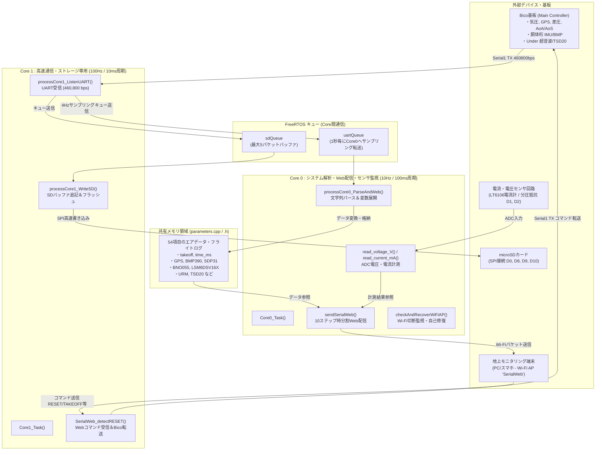
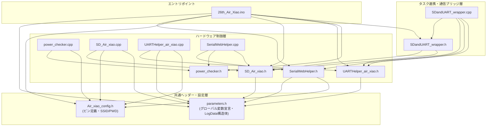
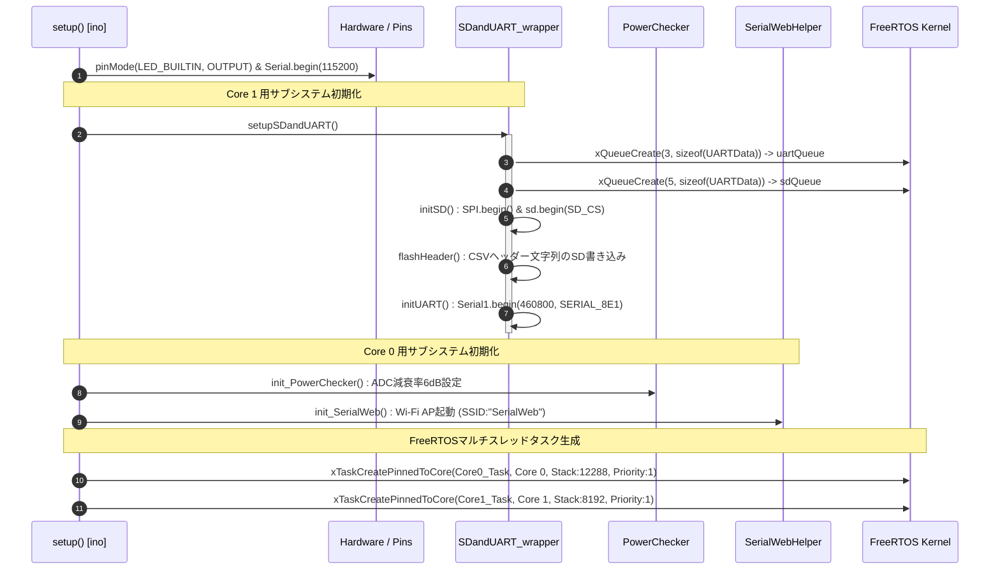
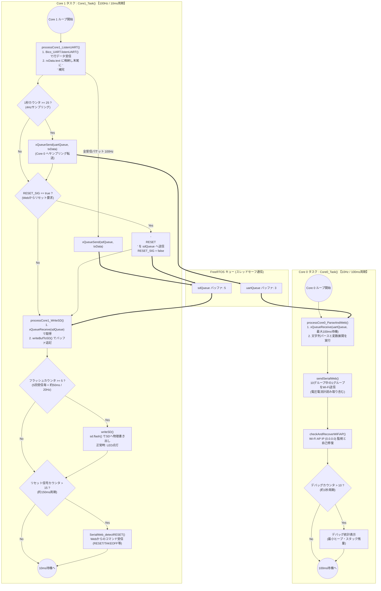
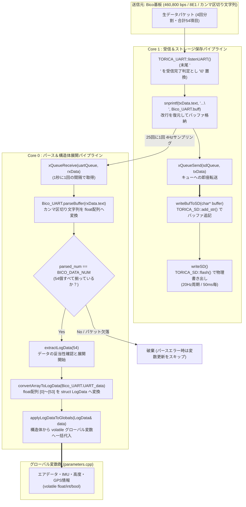
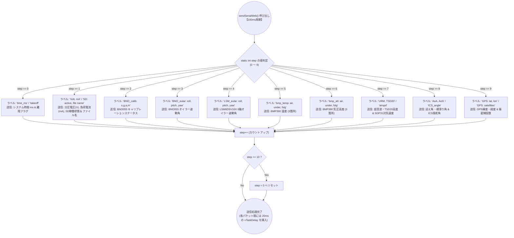
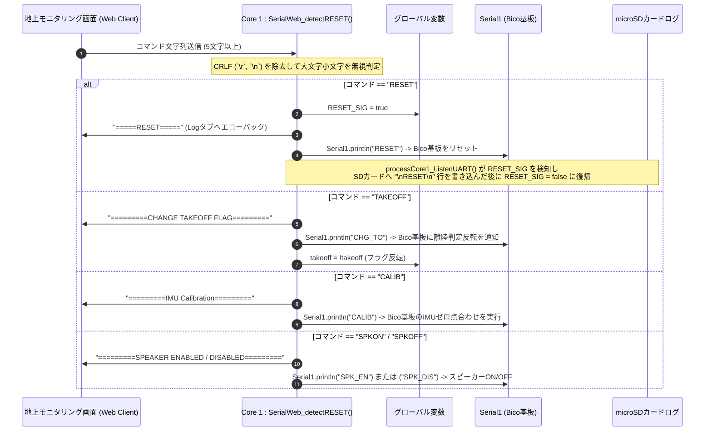
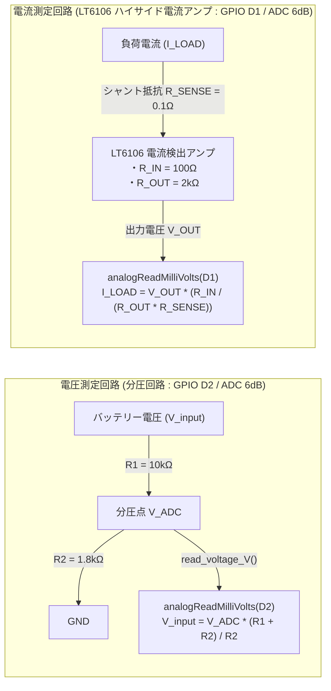
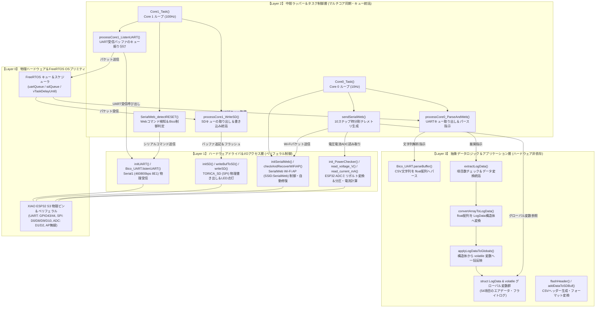

# draw.io 用 Mermaid インポートガイド＆貼り付けコード集

このドキュメントは、作成した図解を **draw.io（app.diagrams.net）** へそのまま貼り付けてノードやエッジを自由に編集できるようにするためのガイドと、draw.io のインポート機能に最適化した純粋な Mermaid コード集です。

---

## 1. draw.io への Mermaid インポート手順

1. **draw.io (diagrams.net)** の編集画面を開きます。
2. 上部メニューの **「配置 (Arrange)」** ＞ **「挿入 (Insert)」** ＞ **「高度な設定 (Advanced)」** ＞ **「Mermaid...」** を選択します。
   （または、画面左上の **「＋（プラス）」** アイコンをクリック ＞ **「高度な設定 (Advanced)」** ＞ **「Mermaid...」** ）
3. 表示されたテキストボックスに、下の各項目 **【コードをコピー】** 内の Mermaid コードを貼り付けます（コードブロック内の文字のみ）。
4. **「挿入 (Insert)」** ボタンをクリックすると、図形オブジェクト（ノードと矢印のまとまり）としてキャンバス上に自動配置されます！
5. 配置後は、draw.io の機能で各ノードの色を変えたり、矢印の形を調整したり、テキストを自由に再編集できます。

---

## 2. draw.io 貼り付け用 Mermaid コード集

### ① システム全体の概要（全体アーキテクチャ）
*【対応箇所】: `docs/README.md`*

---

### ② ファイル間の依存関係（インクルード結合図）
*【対応箇所】: `docs/01_file_relationships.md`*

---

### ③ システム初期化・タスク起動シーケンス図 (`setup()`)
*【対応箇所】: `docs/02_core_tasks_flowchart.md`*

---

### ④ マルチコア処理・Core0 / Core1 ループとキュー間通信
*【対応箇所】: `docs/02_core_tasks_flowchart.md`*

---

### ⑤ データ受信・パース・展開・ログ保存フローチャート
*【対応箇所】: `docs/03_data_pipeline_flowchart.md`*

---

### ⑥ 10ステップ時分割テレメトリ Wi-Fi 送信フロー (`sendSerialWeb()`)
*【対応箇所】: `docs/04_web_command_flowchart.md`*

---

### ⑦ Webクライアントからのコマンド制御シーケンス図 (`SerialWeb_detectRESET()`)
*【対応箇所】: `docs/04_web_command_flowchart.md`*

---

### ⑧ 電圧・電流計測の回路構成図 (`power_checker.cpp`)
*【対応箇所】: `docs/04_web_command_flowchart.md`*

---

### ⑨ ソフトウェアレイヤー構造・関数ヒエラルキーと処理関係
*【対応箇所】: `docs/06_layer_hierarchy_flowchart.md`*

