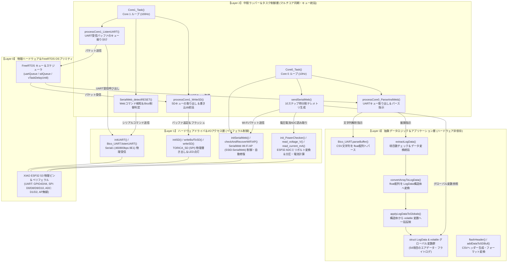

# ソフトウェアレイヤー構造・関数ヒエラルキーと処理関係

本ドキュメントでは、`26th_Air_Xiao` プロジェクトにおける各関数が「物理デバイスやハードウェアレジスタに近い低レイヤー関数」なのか、「タスク間通信やバッファ管理を行う中間ラッパーなのか」、「データの抽象化・変換・構造体展開を担う高レイヤー抽象関数なのか」を明確に分類した階層（ヒエラルキー）図と、階層間での処理の呼び出し関係を解説します。

---

## 1. レイヤー階層（ヒエラルキー）の定義と役割

システム全体の設計を以下の4階層に分割して整理しています。

| 階層 | レイヤー名 | 役割・責務 | 該当する主なモジュール・関数 |
| :---: | :--- | :--- | :--- |
| **Layer 3** | **抽象データロジック層** *(Abstracted Data Layer)* | ハードウェアを意識しない純粋なデータ変換、文字列展開、構造体マッピング、グローバル状態保持 | `convertArrayToLogData()`, `applyLogDataToGlobals()`, `extractLogData()`, `Bico_UART.parseBuffer()`, `LogData` 構造体, 54個の `volatile` 変数 |
| **Layer 2** | **中間ラッパー＆タスク制御層** *(Middleware / Task Wrapper)* | FreeRTOSタスクループ、コア間のキュー受け渡し、時分割送信制御、コマンド検知 | `Core0_Task()`, `Core1_Task()`, `processCore0_ParseAndWeb()`, `processCore1_ListenUART()`, `processCore1_WriteSD()`, `sendSerialWeb()`, `SerialWeb_detectRESET()` |
| **Layer 1** | **ハードウェアドライバ＆I/O制御層** *(Hardware Driver Layer)* | SPI / UART / ADC / Wi-Fi ペリフェラル通信、ハードウェアレジスタの直接操作 | `initSD()`, `writeBufToSD()`, `writeSD()`, `initUART()`, `Bico_UART.listenUART()`, `read_voltage_V()`, `read_current_mA()`, `checkAndRecoverWiFiAP()`, `initSerialWeb()` |
| **Layer 0** | **物理ハードウェア＆RTOSカーネル** *(Physical Hardware / Kernel)* | ESP32 S3 デュアルコア CPU、ペリフェラルピン、FreeRTOS OSプリミティブ | GPIOピン (`D0`〜`D10`, `43`/`44`, `D1`/`D2`), `Serial1`, SPIバス, ADC減衰器, `xQueueSend/Receive`, `vTaskDelayUntil` |

---

## 2. ソフトウェアレイヤーヒエラルキー＆処理関係の統合フローチャート

以下の図は、上段から下段へと向かう**レイヤー抽象度の高さ（上：高レイヤー・抽象ロジック ⇔ 下：低レイヤー・物理I/O）** と、その中での関数呼び出し・データフローを示しています。

---

## 3. レイヤー間の分離メリットと設計上の特長

1. **Layer 3（抽象データロジック）の独立性**
   - `LogData` 構造体や `convertArrayToLogData()` などは、通信速度やハードウェアピン、SPI の物理的な制約を一切意識せず、「float型の配列から特定の変数へ代入する」という純粋なビジネスロジックに集中しています。これにより、将来センサが増減した際も Layer 3 の変数変更のみで対応可能です。

2. **Layer 2（タスク・キューラッパー）によるコア間の調停**
   - Layer 1（ハードウェアドライバ）は本来単一のコアからアクセスされることを前提としますが、Layer 2 が `uartQueue` や `sdQueue` という Layer 0（RTOSプリミティブ）を介することで、Core 1 の高速な UART/SD 通信と Core 0 の遅いパース・Web 処理を完全に分離し、競合（データレース）を回避しています。

3. **Layer 1（ハードウェアドライバ）のカプセル化**
   - 分圧抵抗計算や電流計 LT6106 のシャント抵抗計算 (`power_checker.cpp`)、SPI CSピン選択 (`SD_Air_xiao.cpp`)、UART ボーレート設定 (`UARTHelper_air_xiao.cpp`) などの物理回路に依存するパラメータを Layer 1 に閉じ込めることで、上位レイヤーからは `read_voltage_V()` や `writeSD()` というシンプルなインターフェースで安全に呼び出せるようになっています。
