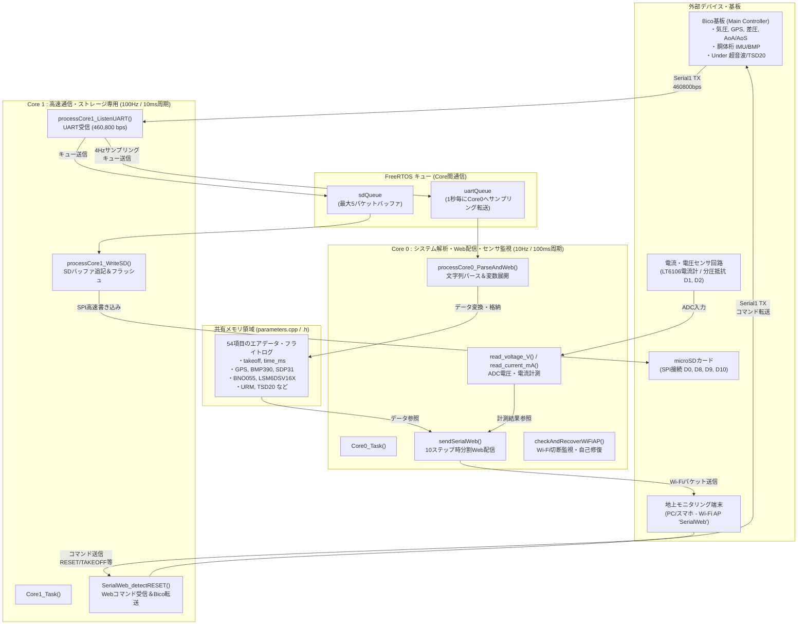

# XIAO ESP32 S3 ソフトウェア仕様書（エアデータ・ロガー・Wi-Fiテレメトリ通信部）

この `docs` ディレクトリには、`26th_Air_Xiao.ino` を中核とする XIAO ESP32 S3 用プログラムの全容・ファイル間関係・関数仕様・マルチコアタスク構成を解説するドキュメントと、Mermaid形式のフローチャートを収録しています。

---

## 1. ドキュメント構成（目次）

本ドキュメントは以下の6部構成（＋draw.io貼り付け用コード集の全7ファイル）となっています。各Markdownファイル内で詳細なMermaidチャートと解説を記述しています。

| ファイル名 | タイトル | 概要 |
| :--- | :--- | :--- |
| **[`01_file_relationships.md`](01_file_relationships.md)** | **ファイル間関係とモジュール構成** | 各 `.ino`, `.h`, `.cpp` ファイルの責務、依存関係（インクルードグラフ）、データ保持・共有の仕組み |
| **[`02_core_tasks_flowchart.md`](02_core_tasks_flowchart.md)** | **マルチコア処理・FreeRTOSタスクフロー** | Core 0（解析・Web通信・電力計測）および Core 1（高速UART受信・SDログ保存）のタスク構成とキュー通信 |
| **[`03_data_pipeline_flowchart.md`](03_data_pipeline_flowchart.md)** | **データ受信・パース・展開・ログ保存フロー** | Bico基板（Main）からの54項目データ受信から構造体変換、グローバル変数への反映、SD書き込み・Web送信までの関数連携 |
| **[`04_web_command_flowchart.md`](04_web_command_flowchart.md)** | **SerialWeb通信・コマンド制御・電力計測** | Wi-Fi Access Point 経由の分割テレメトリ送信（10ステップマルチプレクス）、Webコマンド（RESET, TAKEOFF等）受信、LT6106電流・分圧電圧計測 |
| **[`06_layer_hierarchy_flowchart.md`](06_layer_hierarchy_flowchart.md)** | **レイヤー構造・関数ヒエラルキーと処理関係** | 各関数を物理I/O・ハードウェアドライバ・中間ラッパー・抽象データロジックの4階層に分類し、処理やデータアクセスの呼び出し関係を明示した階層図 |
| **[`05_drawio_mermaid_snippets.md`](05_drawio_mermaid_snippets.md)** | **draw.io用貼り付けコード＆インポート手順** | draw.io (app.diagrams.net) の Mermaid インポート機能に最適化した、そのまま1クリックで貼り付け可能な全図解コード集とインポート手順 |

---

## 2. システム全体の概要（全体アーキテクチャ）

XIAO ESP32 S3 は、エアデータ計測システムの「データ収集ハブ兼フライトデータレコーダー・地上モニタリング親機」として機能します。
FreeRTOS のマルチコア機能（Core 0 と Core 1）を最大限に活用し、**「100Hzの高速SDカード記録・UART通信」** と **「Wi-Fiテレメトリ配信・文字列パース・環境計測」** を完全にコア分離して並列実行しています。

---

## 3. コア別タスクの責務まとめ

| コア | タスク関数 | 動作周期 | 実行順序・概要 |
| :---: | :--- | :---: | :--- |
| **Core 0** | `Core0_Task()` | **100ms (10Hz)** | 1. `processCore0_ParseAndWeb()` : キューからUART文字列を受信・パース・構造体展開しグローバル変数へ反映 2. `sendSerialWeb()` : 変数および `read_voltage_V()`, `read_current_mA()` を取得し、10分割のステップ順でWi-Fi送信 3. `checkAndRecoverWiFiAP()` : Wi-Fi AP状態が落ちていないかチェック・再起動 |
| **Core 1** | `Core1_Task()` | **10ms (100Hz)** | 1. `processCore1_ListenUART()` : Bicoからのデータ行(`\n`区切り)を受信し `sdQueue` へ転送＆周期的に `uartQueue` へコピー 2. `processCore1_WriteSD()` : `sdQueue` からデータを取り出してバッファへ書き込み、5回に1回(`writeSD()`)物理フラッシュ 3. `SerialWeb_detectRESET()` : 15サイクル毎にWebからのコマンドを確認してBicoへ転送 |

---
各機能のさらなる詳細やフローチャートについては、`docs/` 内の各Markdownファイルをご確認ください。
